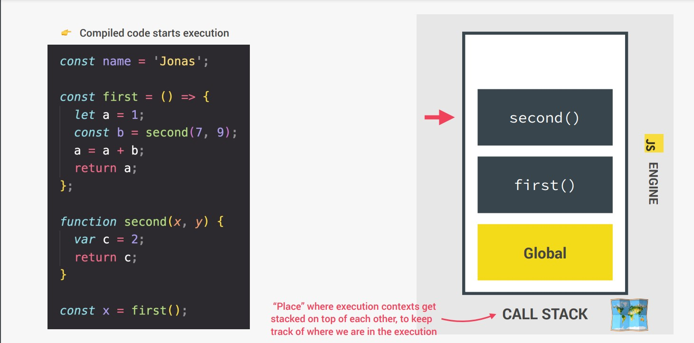

=> JavaScript code will one line at a time.

=> JavaScript code runs always into execution context.

=> First top level code will be excuted and then last line lineby line.

=> first function will be declared and then only function can be called.

=> JavaScript is Synchronous single-threaded language.

### JavaScript context is divided in two parts:

1) Memory component
2) Code component 

=> In memory component, containes variables and functions as the key-value pairs. Also, know as variable enviorment.
=> In code component where whole JavaScript code is executed.Also, know as Thread of Execution

## Lets understand with image:

## Let's understand another example:

Step 1: First global varibal is created so that line will be executed.

Step2 : Function name first is created and then second is created and some sort of logic is done.

Step3 : Function name second is created and called in first function too so atlast first function called and calling second function too.

It is simple because it is small amount of code but how will engine keep track if there is 100 lines of code?
Here concept of `call stack` comes in picture.

## What is call stack?

- Call stack is a place where execution contexts get stacked on top of each other, to keep track of where we are in execution.

